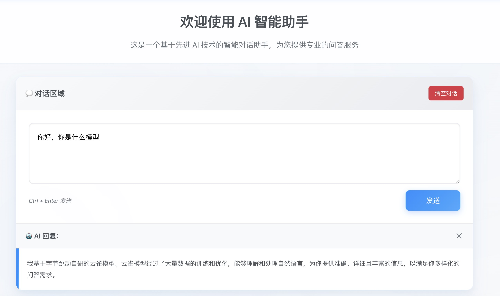
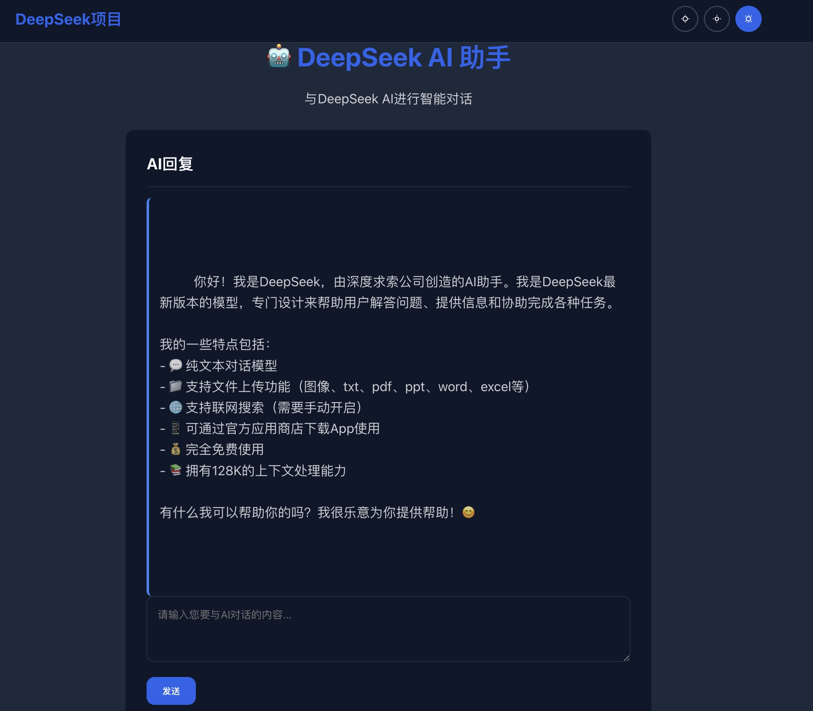

# AI 学习项目集

> 🎓 这是一个用于学习前端和 AI 应用开发的项目集合，采用 Monorepo 架构，仅供学习参考使用。

## 🎨 项目预览

### 项目 Logo & 图标

#### 🤖 AI 智能助手 - 主要 Logo


#### 🔖 Favicon - 网站图标


### 项目界面效果

#### 🤖 Coze AI 智能助手 - 界面预览



##### 基于 Vue 3 + TypeScript + Vite 构建的现代化 AI 对话界面

##### 特色功能

- 🎨 科技风蓝色主题设计
- ⚡ 精确到毫秒的时间显示
- 💬 流畅的对话交互体验
- 📱 PC 端优化的响应式布局

#### 🚀 DeepSeek 项目 - 界面预览



##### 基于 Vue 3 + Vite 构建的现代化应用框架

##### 项目特色

- 🏗️ 完整的项目结构
- 🎨 清爽的界面设计
- ⚡ 快速的开发体验
- 📚 完善的开发工具配置

## 📚 文档

- 📖 [Monorepo 工作原理详解](docs/monorepo-guide.md) - 深入了解 monorepo 的工作机制
- 🚀 [Monorepo 快速入门](docs/quick-start.md) - 简洁的入门指南

## 📁 项目结构 (Monorepo)

```text
ai-learning/                          # 根目录
├── apps/                              # 应用程序
│   ├── coze/                         # 基于 Coze API 的 AI 助手应用
│   └── deepseek/                     # 基于 DeepSeek API 的 AI 对话应用
├── packages/                          # 共享包
│   ├── shared-ui/                    # 共享 UI 组件
│   ├── shared-utils/                 # 共享工具函数
│   ├── shared-types/                 # 共享 TypeScript 类型
│   └── shared-config/                # 共享配置文件
├── package.json                      # 根 package.json
├── pnpm-workspace.yaml               # pnpm 工作区配置
├── tsconfig.json                     # TypeScript 根配置
├── eslint.config.js                  # ESLint 配置
├── .prettierrc                       # Prettier 配置
└── README.md                         # 本文档
```

## 🚀 包含的项目

### 1. coze - AI 智能助手应用

<div align="center">


**基于 Coze API 的现代化智能对话助手**

</div>

- **🎯 核心功能**: 基于 Coze API 的智能对话助手
- **💻 技术栈**: Vue 3 + TypeScript + Vite + pnpm
- **🎨 设计特色**:
  - 自定义机器人 SVG Logo 和 Favicon
  - Ant Design 风格的科技风蓝色主题
  - 毛玻璃效果和现代化 UI 设计
- **⚡ 技术亮点**:
  - 精确到毫秒的时间显示系统
  - 纯前端单页面应用（SPA）
  - PC 端优化的响应式设计
  - 优雅的加载状态和错误处理
  - SVG 图标和渐变背景设计

### 2. deepseek - AI 对话应用 ✅


- **📊 当前状态**: 开发完成，可正常运行
- **🎯 核心功能**: 基于 DeepSeek API 的智能对话系统
- **🛠️ 技术栈**: Vite + Vanilla JavaScript + Prettier
- **✨ 项目特色**:
  - 🎨 主题切换系统（亮色/暗色/自动）
  - 🤖 动态加载 AI 对话模块
  - 💫 流畅的动画效果和交互体验
  - 🔧 完整的开发工具配置
  - 📱 响应式设计，支持多设备访问
- **🚀 核心特性**:
  - 实时 AI 对话功能
  - 主题偏好记忆（LocalStorage）
  - Toast 通知系统
  - 模块化代码架构

## 🛠️ 技术栈

### Monorepo 基础设施

- **工作区管理**: pnpm workspace
- **包管理**: pnpm 10.20.0+
- **代码共享**: 共享组件、工具和类型
- **统一构建**: 并行构建和依赖优化
- **代码规范**: 统一的 ESLint 和 Prettier 配置

### 通用技术

- **构建工具**: Vite 7.1+
- **代码风格**: Prettier + ESLint
- **环境管理**: Node.js 20.19.0+
- **类型支持**: TypeScript 5.9+

### 项目专用技术

- **coze 项目**:
  - Vue 3.5+ (Composition API)
  - TypeScript 5.9+
  - SVG 图标设计

- **deepseek 项目**:
  - Vanilla JavaScript (ES6+)
  - CSS3 动画
  - Web Components
  - LocalStorage API

## 📦 安装和运行

### 环境要求

- Node.js: `^20.19.0 || >=22.12.0`
- pnpm: `>=8.0.0`

### 安装 pnpm

如果还没有安装 pnpm：

```bash
npm install -g pnpm
# 或者
npx pnpm add -g pnpm
```

### 运行项目

#### 一键启动所有应用

```bash
# 在根目录安装所有依赖
pnpm install

# 启动所有应用的开发服务器
pnpm dev

# 构建所有应用和包
pnpm build

# 格式化所有代码
pnpm format

# 代码检查
pnpm lint
```

#### 单独运行应用

```bash
# 只运行 coze 应用
pnpm --filter @ai-learning/coze dev

# 只运行 deepseek 应用
pnpm --filter @ai-learning/deepseek dev

# 构建特定包
pnpm --filter @ai-learning/shared-ui build
```

## 🔧 开发工具

### 可用脚本

每个项目都包含以下脚本：

```bash
pnpm dev          # 启动开发服务器
pnpm build        # 构建生产版本
pnpm preview      # 预览构建结果
pnpm lint         # 代码检查和修复
```

### 环境配置

对于需要 API 密钥的项目（如 coze），需要在项目根目录创建 `.env` 文件：

```env
# coze/.env
VITE_BOT_ID=your_bot_id_here
VITE_API_KEY=your_api_key_here
```

## 📚 学习目标

通过这些项目，你可以学习到：

### 前端框架与技术

- ✅ Vue 3 Composition API 的使用 (coze)
- ✅ TypeScript 类型安全的实践 (coze)
- ✅ Vanilla JavaScript 模块化开发 (deepseek)
- ✅ 响应式设计和用户体验优化

### 构建与开发工具

- ✅ Vite 现代化构建工具的使用
- ✅ pnpm 包管理器的最佳实践
- ✅ Prettier + ESLint 代码规范配置
- ✅ 热模块替换（HMR）开发体验

### AI 应用集成

- ✅ Coze API 集成和错误处理
- ✅ DeepSeek API 对话系统实现
- ✅ 动态模块加载技术
- ✅ 异步 API 调用最佳实践

### 现代前端开发

- ✅ SVG 图标设计和应用
- ✅ CSS3 动画和过渡效果
- ✅ 主题切换系统实现
- ✅ LocalStorage 数据持久化
- ✅ 模块化代码架构设计

### Monorepo 优势

- ✅ **代码复用**: 共享 UI 组件、工具函数和类型定义
- ✅ **依赖管理**: 统一的依赖版本管理和去重
- ✅ **开发效率**: 一次安装，同时开发多个应用
- ✅ **构建优化**: 共享构建缓存，并行构建
- ✅ **代码规范**: 统一的代码风格和质量检查
- ✅ **类型安全**: 跨项目的 TypeScript 类型共享

### 共享包说明

#### @ai-learning/shared-types

- **用途**: 共享 TypeScript 类型定义
- **包含**: API 响应类型、组件 Props 类型、工具类型
- **使用**: 所有应用和包都可导入使用

#### @ai-learning/shared-utils

- **用途**: 通用工具函数库
- **包含**: 存储、日期、字符串、主题、API 等工具函数
- **特点**: 纯函数、类型安全、无副作用

#### @ai-learning/shared-ui

- **用途**: Vue 3 UI 组件库
- **包含**: 按钮、输入框、聊天消息、加载动画等组件
- **特性**: 响应式设计、主题支持、TypeScript 支持

#### @ai-learning/shared-config

- **用途**: 共享配置文件
- **包含**: 构建配置、代码规范配置
- **目标**: 统一开发标准和工具配置

## 🖼️ 项目资源

### 📁 文件结构

```text
coze/
├── public/
│   ├── favicon.ico          # 备用 ICO 图标
│   ├── favicon.svg          # SVG 网站图标 (32x32)
│   └── manifest.json        # PWA 配置文件
├── src/
│   └── assets/
│       ├── ai-assistant-logo.svg    # 主要 Logo (40x40)
│       ├── base.css                 # 基础样式
│       └── main.css                 # 主样式
└── src/
    ├── App.vue              # 主应用组件
    └── main.ts              # 入口文件
```

### 🎨 图标设计

#### 主要 Logo (ai-assistant-logo.svg)

- **尺寸**: 40x40 像素
- **格式**: SVG 矢量图
- **特点**:
  - 渐变色彩设计
  - 机器人形象
  - 科技感十足
- **用途**: 应用主标识

#### Favicon (favicon.svg)

- **尺寸**: 32x32 像素
- **格式**: SVG 矢量图
- **特点**:
  - 简化版机器人设计
  - 适合小尺寸显示
  - 网页标签页图标
- **用途**: 网站 Favicon

## 🎯 项目特点

### 代码质量

- ✅ 完整的 TypeScript 类型支持
- ✅ ESLint 代码规范检查
- ✅ 现代化的 Vue 3 开发模式
- ✅ 清晰的项目结构和组件分离

### 用户体验

- ✅ 精确到毫秒的时间显示
- ✅ 优雅的加载状态和错误处理
- ✅ PC 端优化的界面设计
- ✅ 流畅的动画和过渡效果
- ✅ 自定义 SVG 图标和品牌设计

### 开发体验

- ✅ 热模块替换（HMR）
- ✅ 类型检查和自动补全
- ✅ 优化的构建配置
- ✅ 统一的包管理器配置 (pnpm)
- ✅ 完整的 Favicon 和 PWA 支持

## 📖 学习建议

### 前置知识

- HTML/CSS/JavaScript 基础
- ES6+ 语法特性
- Vue.js 基础概念

### 学习路径

1. 先熟悉 Vue 3 和 TypeScript 基础
2. 理解 Vite 的工作原理
3. 学习 pnpm 包管理器的使用
4. 实践 AI API 的集成
5. 优化用户体验和代码质量

## 🤝 贡献指南

欢迎提交 Issue 和 Pull Request 来改进这些学习项目！

## 📄 许可证

本项目仅供学习参考，请勿用于商业用途。

## 🔗 相关资源

- [Vue 3 官方文档](https://vuejs.org/)
- [TypeScript 文档](https://www.typescriptlang.org/)
- [Vite 文档](https://vitejs.dev/)
- [pnpm 文档](https://pnpm.io/)
- [Coze API 文档](https://www.coze.com/docs/developer_guides/api_overview)

## 📸 媒体资源

### 图片使用说明

- **🎨 自定义设计**: 所有 SVG 图标均为手工设计，具有独特的科技感
- **📱 多尺寸支持**: 提供了主要 Logo 和 Favicon 两种尺寸
- **🌐 网站优化**: SVG 格式确保在任何分辨率下都保持清晰
- **🔧 易于定制**: SVG 文件可以轻松修改颜色和样式

### 资源文件

1. **主要 Logo**: [`coze/src/assets/ai-assistant-logo.svg`](coze/src/assets/ai-assistant-logo.svg)
2. **Favicon**: [`coze/public/favicon.svg`](coze/public/favicon.svg)
3. **备用图标**: `coze/public/favicon.ico`

---

> 💡 **提示**: 这些项目主要用于学习前端开发和 AI 应用集成。请根据实际需求调整和优化代码。
>
> 🎨 **设计灵感**: SVG 图标设计参考了现代 UI 趋势，结合了 Ant Design 的色彩体系和科技感设计元素。
