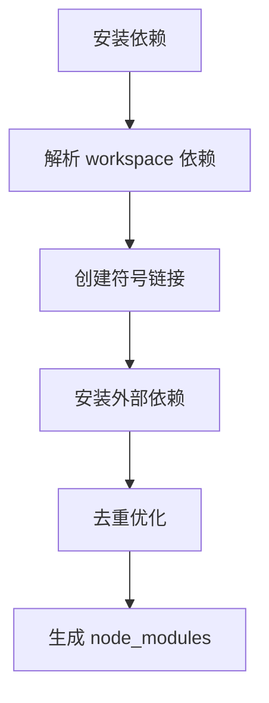

# Monorepo 工作原理详解

## 🔍 概述

Monorepo（单一仓库）是一个代码仓库管理策略，将多个相关的项目/包放在同一个 Git 仓库中统一管理。本文档详细解释 monorepo 的工作原理和实现机制。

## 📋 目录

- [核心概念](#核心概念)
- [工作机制](#工作机制)
- [实践案例](#实践案例)
- [优势对比](#优势对比)
- [最佳实践](#最佳实践)

## 🎯 核心概念

### 什么是 Monorepo

Monorepo 是一种代码组织方式，将多个相关项目存储在同一个版本控制仓库中。每个项目可以独立开发和发布，但共享统一的工具链和依赖管理。

### 关键组件

1. **工作区（Workspace）**: 定义包的组织结构
2. **包管理器**: 处理依赖解析和链接
3. **构建工具**: 支持并行构建和增量编译
4. **版本管理**: 统一版本发布策略

## ⚙️ 工作机制

### 1. 工作区管理

#### 目录结构

```
ai-learning/
├── apps/           # 应用程序
│   ├── coze/       # Vue 3 AI 助手应用
│   └── deepseek/   # JavaScript AI 对话应用
├── packages/       # 共享包
│   ├── shared-ui/      # UI 组件库
│   ├── shared-utils/   # 工具函数
│   ├── shared-types/   # 类型定义
│   └── shared-config/  # 配置文件
├── tools/          # 构建工具和脚本
├── docs/           # 项目文档
├── package.json    # 根配置文件
└── pnpm-workspace.yaml  # 工作区配置
```

#### 工作区配置 (`pnpm-workspace.yaml`)

```yaml
packages:
  - 'apps/*'        # 包含 apps 目录下的所有包
  - 'packages/*'    # 包含 packages 目录下的所有包
  - 'tools/*'       # 包含 tools 目录下的所有包
```

### 2. 依赖解析机制

#### 依赖类型

1. **内部依赖**: 工作区内的包相互依赖
2. **外部依赖**: 来自 npm registry 的依赖
3. **开发依赖**: 仅开发时需要的工具

#### 依赖解析流程



#### 内部依赖示例

```json
// packages/shared-utils/package.json
{
  "name": "@ai-learning/shared-utils",
  "dependencies": {
    "@ai-learning/shared-types": "workspace:*"
  }
}
```

`workspace:*` 表示引用工作区内的最新版本，pnpm 会自动创建符号链接到对应的包目录。

### 3. 构建流程

#### 并行构建

```bash
pnpm build
```

执行流程：

1. 分析依赖关系图
2. 按拓扑顺序并行构建
3. 共享构建缓存
4. 优化构建时间

#### 构建顺序示例

```
Phase 1: shared-types (无依赖)
Phase 2: shared-utils (依赖 shared-types)
Phase 3: shared-ui (依赖 shared-types + shared-utils)
Phase 4: apps/* (依赖所有共享包)
```

### 4. 包引用机制

#### 符号链接机制

```bash
# 传统方式
node_modules/@ai-learning/shared-utils -> 复制的文件

# monorepo 方式
node_modules/@ai-learning/shared-utils -> ../../packages/shared-utils
```

#### 类型检查

TypeScript 项目引用配置：

```json
// tsconfig.json
{
  "compilerOptions": {
    "paths": {
      "@ai-learning/shared-types": ["./packages/shared-types/src"],
      "@ai-learning/shared-utils": ["./packages/shared-utils/src"],
      "@ai-learning/shared-ui": ["./packages/shared-ui/src"]
    }
  },
  "references": [
    { "path": "./packages/shared-types" },
    { "path": "./packages/shared-utils" },
    { "path": "./packages/shared-ui" }
  ]
}
```

## 🚀 实践案例

### AI-Learning 项目案例

#### 包架构

```typescript
// packages/shared-types/src/index.ts
export interface ChatMessage {
  id: string
  role: 'user' | 'assistant' | 'system'
  content: string
  timestamp: number
}

// packages/shared-utils/src/index.ts
import { ChatMessage } from '@ai-learning/shared-types'

export const formatDate = (timestamp: number): string => {
  return new Date(timestamp).toLocaleTimeString()
}

// packages/shared-ui/src/components/ChatMessage.vue
import { ChatMessage } from '@ai-learning/shared-types'
import { formatDate } from '@ai-learning/shared-utils'
```

#### 应用使用

```typescript
// apps/coze/src/components/Chat.vue
import { ChatMessage } from '@ai-learning/shared-types'
import { BaseButton } from '@ai-learning/shared-ui'
import { storage } from '@ai-learning/shared-utils'
```

### 开发命令

#### 常用命令

```bash
# 安装所有依赖
pnpm install

# 启动所有应用（并行）
pnpm dev
# 输出: coze:4000 + deepseek:3000

# 构建所有包
pnpm build

# 针对特定包操作
pnpm --filter @ai-learning/coze dev
pnpm --filter "@ai-learning/shared-*" build

# 代码格式化
pnpm format

# 代码检查
pnpm lint
```

## 📊 优势对比

### Monorepo vs Multi-Repo

| 特性 | Monorepo | Multi-Repo |
|------|----------|------------|
| **代码共享** | 直接引用，类型安全 | 复制粘贴或 npm 包 |
| **依赖管理** | 统一管理，自动去重 | 各自安装，可能重复 |
| **版本同步** | 自动统一 | 手动协调 |
| **构建时间** | 并行构建，增量编译 | 累积构建时间 |
| **工具配置** | 统一配置，一次设置 | 重复配置，维护困难 |
| **重构操作** | 跨项目安全重构 | 需要多仓库协调 |
| **CI/CD** | 统一流程，简化配置 | 多个独立流程 |

### 依赖优化示例

#### 传统 Multi-Repo

```
coze/
  node_modules/
    vue@3.5.22          2.5MB
    vite@7.1.11         1.8MB
    typescript@5.9.0    1.2MB

deepseek/
  node_modules/
    vue@3.5.22          2.5MB (重复)
    vite@7.1.11         1.8MB (重复)
    prettier@3.6.2      0.8MB

总大小: ~10.6MB
```

#### Monorepo

```
ai-learning/
  node_modules/
    vue@3.5.22          2.5MB (共享)
    vite@7.1.11         1.8MB (共享)
    typescript@5.9.0    1.2MB (共享)
    prettier@3.6.2      0.8MB (共享)

总大小: ~6.3MB (节省 40%)
```

## 🛠️ 最佳实践

### 1. 目录结构规范

#### 推荐结构

```
project/
├── apps/           # 最终用户应用
├── packages/       # 可复用的库和包
├── tools/          # 构建和开发工具
├── docs/           # 项目文档
└── examples/       # 使用示例
```

#### 命名规范

- 应用: `@company/app-name`
- 包: `@company/package-name`
- 工具: `@company/tool-name`

### 2. 依赖管理

#### 依赖层级

```
apps (依赖) → packages (依赖) → external packages
```

#### 版本管理

```json
// 根目录 package.json
{
  "devDependencies": {
    "vue": "^3.5.0",
    "typescript": "~5.9.0",
    "vite": "^7.1.0"
  }
}

// 子包继承根版本
{
  "devDependencies": {
    "typescript": "workspace:*"  // 使用根目录版本
  }
}
```

### 3. 构建优化

#### 增量构建

```bash
# 只构建变化的包
pnpm build --filter="...[origin/main]"

# 缓存构建结果
pnpm build --aggregate-output
```

#### 并行执行

```json
{
  "scripts": {
    "build": "pnpm -r build",
    "dev": "pnpm -r --parallel dev",
    "test": "pnpm -r --stream test"
  }
}
```

### 4. 发布策略

#### Changesets 方案

```bash
# 添加变更记录
pnpm changeset

# 版本升级
pnpm changeset version

# 发布到 npm
pnpm changeset publish
```

#### 自动化发布

```yaml
# .github/workflows/release.yml
name: Release
on:
  push:
    branches: [main]
jobs:
  release:
    runs-on: ubuntu-latest
    steps:
      - uses: actions/checkout@v3
      - uses: pnpm/action-setup@v2
      - run: pnpm install
      - run: pnpm build
      - run: pnpm changeset publish
```

### 5. 开发工具配置

#### 统一 ESLint 配置

```javascript
// eslint.config.js
export default [
  {
    files: ['**/*.{js,ts,vue}'],
    rules: {
      // 统一的代码规范
    }
  }
]
```

#### 共享 TypeScript 配置

```json
// tsconfig.json
{
  "compilerOptions": {
    "strict": true,
    "target": "ES2020",
    "module": "ESNext"
  },
  "include": ["apps/*/src/**/*", "packages/*/src/**/*"]
}
```

## 🚨 注意事项

### 潜在挑战

1. **构建复杂性**: 需要合理配置构建顺序
2. **权限管理**: 大型团队需要细化权限控制
3. **学习成本**: 团队需要学习 monorepo 工作流
4. **工具兼容**: 确保所有工具支持 monorepo

### 解决方案

1. **渐进式迁移**: 先迁移简单项目，逐步扩展
2. **文档完善**: 提供详细的使用指南
3. **工具选择**: 选择成熟的 monorepo 工具链
4. **团队培训**: 组织 monorepo 最佳实践分享

## 📚 参考资源

### 官方文档

- [pnpm 工作区文档](https://pnpm.io/workspaces)
- [Turborepo 文档](https://turbo.build/repo/docs)
- [Nx 文档](https://nx.dev/)

### 推荐工具

- **包管理器**: pnpm, Yarn Workspaces, Lerna
- **构建工具**: Turborepo, Nx, Rush
- **版本管理**: Changesets, Semantic Release
- **CI/CD**: GitHub Actions, GitLab CI

### 实战案例

- [Vue 3 Monorepo](https://github.com/vuejs/core)
- [Vite Monorepo](https://github.com/vitejs/vite)
- [Babel Monorepo](https://github.com/babel/babel)

---

## 🎯 总结

Monorepo 通过统一的工作区管理、智能的依赖解析和并行的构建机制，为多项目开发提供了高效的解决方案。正确使用 monorepo 可以显著提升开发效率、代码质量和团队协作体验。

关键成功因素：

- 合理的目录结构设计
- 统一的工具链配置
- 清晰的依赖关系管理
- 完善的文档和规范
